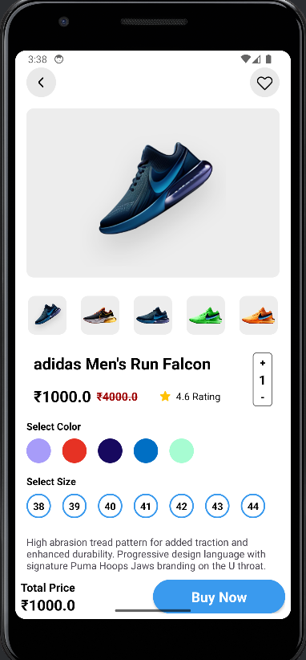
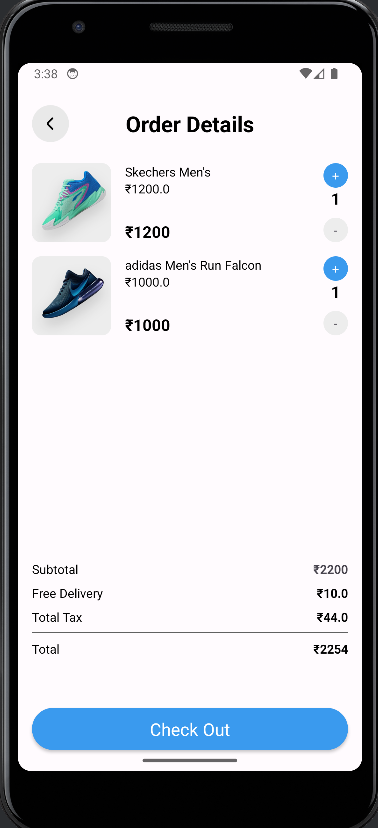

# 🛒 ShopCart – Android Shopping App

ShopCart is a modern **Android e-commerce application** developed using **XML for UI**, **Kotlin for application logic**, and **Firebase** as the backend.  
The app provides a smooth and intuitive shopping experience with product browsing, cart management, and order summary features.

---

## ✨ Features

- 🚀 Attractive onboarding screen  
- 🏠 Home screen with product recommendations  
- 🔍 Product details page with:
  - Product image gallery  
  - Color & size selection  
  - Quantity selector  
- 🛒 Cart & order details screen  
- 💰 Automatic price calculation (subtotal, tax, delivery, total)  
- ❤️ Wishlist / favorites UI  
- 🎨 Clean and modern UI design  

---

## 📱 App Screenshots

> Add these images inside a folder named **`screenshots/`** in the root of the repository.

### Onboarding Screen

### Home Screen

### Product Details Screen

### Order Details / Cart Screen

---

## 🛠 Tech Stack

- **Language:** Kotlin  
- **UI:** XML (ConstraintLayout, RecyclerView, Material Components)  
- **Architecture:** MVVM  
- **Backend:** Firebase  
  - Firebase Authentication  
  - Firebase Firestore / Realtime Database  
- **Build System:** Gradle (Kotlin DSL)  

---

## 📂 Project Structure

